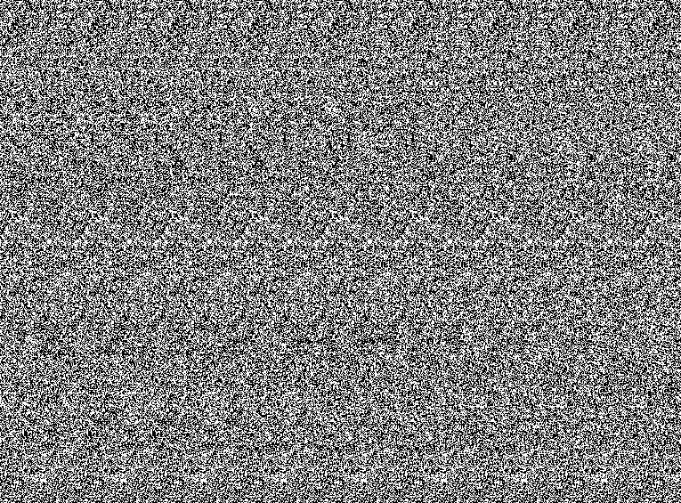
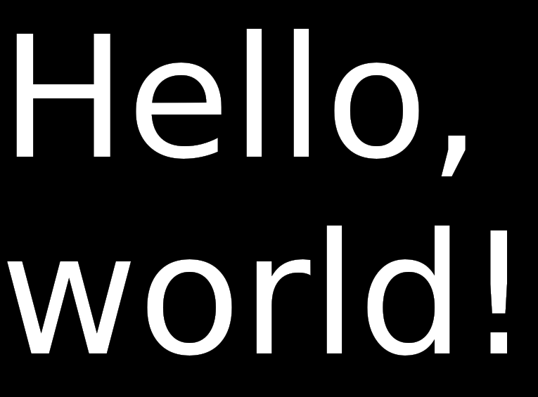

# stereogram

Simple generator of Single Image Random Dot Stereograms (SIRDS).

Based on an included paper - "Displaying 3D Images: Algorithms for Single Image Random Dot Stereograms" by Harold W. Thimbleby, Stuart Inglis, and Ian H. Witten.

## What it does

Image below contains example of SIRDS image generated by this application.
Try to focus your vision slightly behind the screen, and you'll see three-dimensional "Hello, world!".

Depth map used for this example.

## How to use

Type `./stereogram --help` to access help.

## How to build

Requires: Conan, CMake and C++14 conformant compiler.
Tested on WSL Ubuntu 18.04. 

* `mkdir build && cd build`
* `conan install .. --build missing`
* `cmake ..`
* `cmake --build .`
